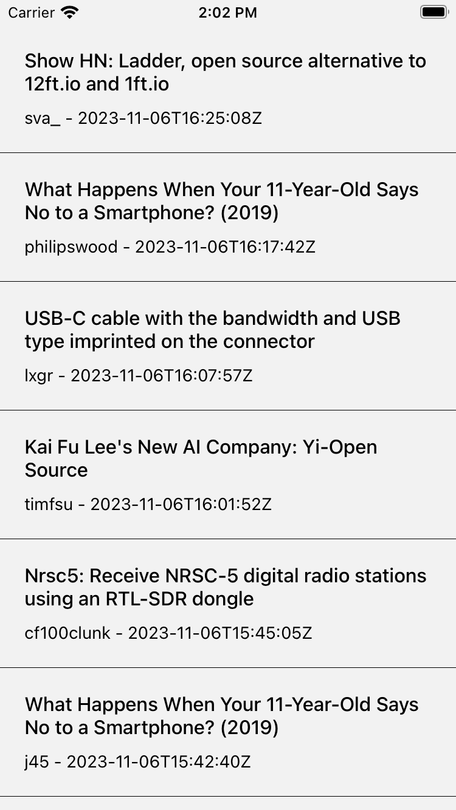
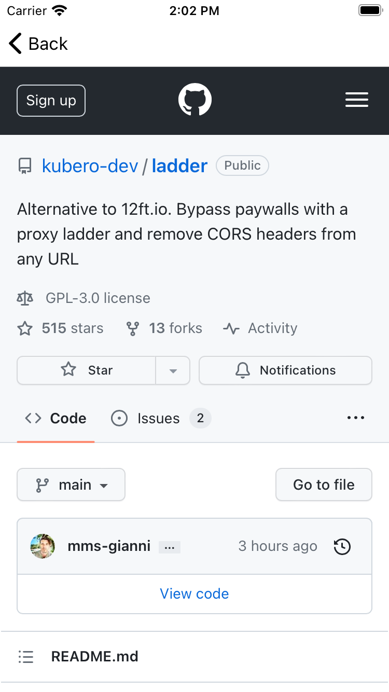
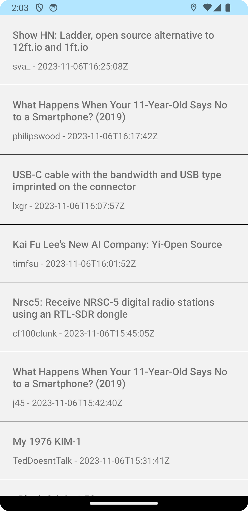
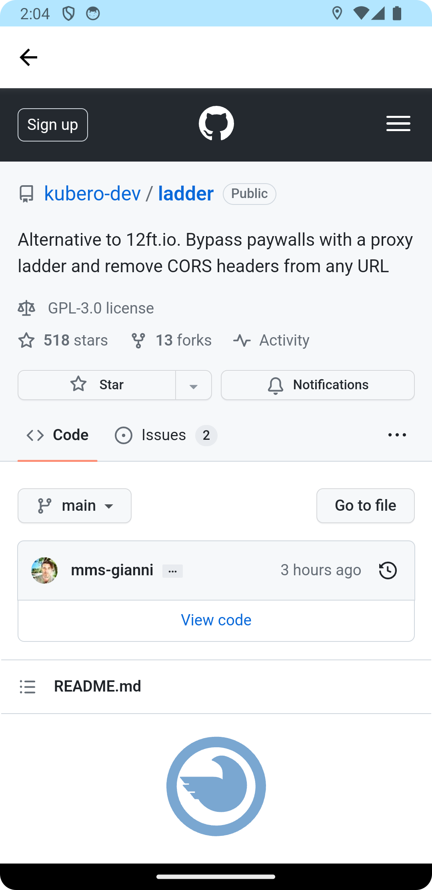

# Getting Started

This simple React Native application shows implementations of MVVM + Clean architecture as well as unit testing from the data layer through to the presentation layer. The application has 2 screens - a list view and a detail (webview) view:

### iPhone




### Android



## Step 1: Install packages + dependencies
```bash
yarn install
```

## Step 2: Start the Metro Server

First, you will need to start **Metro**, the JavaScript _bundler_ that ships _with_ React Native.

To start Metro, run the following command from the _root_ of your React Native project:

```bash
# using npm
npm start

# OR using Yarn
yarn start
```

## Step 3: Start your Application

Make sure either Android Studio or the Simulator app is open. 
Let Metro Bundler run in its _own_ terminal. Open a _new_ terminal from the _root_ of your React Native project. Run the following command to start your _Android_ or _iOS_ app:

### For Android

```bash
# using npm
npm run android

# OR using Yarn
yarn android
```

### For iOS

```bash
# using npm
npm run ios

# OR using Yarn
yarn ios
```

If everything is set up _correctly_, you should see your new app running in your _Android Emulator_ or _iOS Simulator_ shortly provided you have set up your emulator/simulator correctly.

This is one way to run your app — you can also run it directly from within Android Studio and Xcode respectively.

